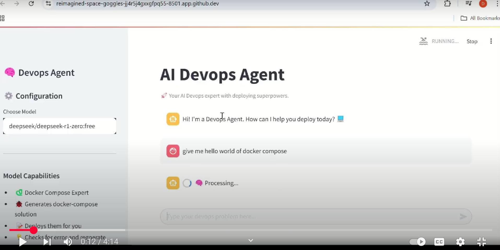

This repository tries to solve docker compose deployment problems through an AI Agent.

[](https://www.youtube.com/watch?v=wCm5Dx_D90I&ab_channel=DeepanshuYadav)


# Pre Requisites
## Installation of docker 

Install docker from [here](https://docs.docker.com/engine/install/)

## Installation of docker-compose

Install docker compose from [here](https://docs.docker.com/compose/install/)

## Now install requirements.txt 

Which ever python  installation you are running be it virtual environment or anaconda 
install `pip install -r requirements.txt`

## Construct RAG
For generating RAG you need to clone some existing docker repositories

```
mkdir -p repos
cd repos
git clone https://github.com/Haxxnet/Compose-Examples.git

git clone https://github.com/docker/awesome-compose.git 

git clone https://github.com/ruanbekker/awesome-docker-compose.git

```

## Select either offline or online model. It could be ollama or online using 
## openrouter free key.  

## Note 
### If you are using github codespaces then it is very easy to try this just use

```
chmod +x setup.sh
./setup.sh
```

# Model selection 
## Offline models
### Installation of ollama 

install ollama from [here](https://ollama.com/download)

### Install offline models of deep seek
In one terminal keep running the following
```
ollama serve 
```

Also download these models
```
ollama pull deepseek-r1:1.5b 
ollama pull deepseek-r1:7b
ollama pull deepseek-r1:32b
ollama pull deepcoder:14b 
ollama pull llama3.2:3b 
ollama pull llama3.2:1b
ollama pull deepcoder:1.5b
ollama pull gemma3:4b 
ollama pull gemma3:12b 
ollama pull gemma3:4b
```

After downloading test the models using
by first downloading curl and then use

```
curl http://localhost:11434/api/generate -d '{
  "model": "deepseek-r1:1.5b",
  "prompt": "one word about me just one word",
  "stream": false
}'
```

Make sure it works and it keeps on running at `11434`

## Online model (free tier)

1. Go to [openrouter](https://openrouter.ai/)
2. Create a free key for deep seek. You need to choose option **DeepSeek-R1 (free)**
3. Copy that key and paste in code snippet given below
4. Run the following code to make sure it works. 

```
from openai import OpenAI

client = OpenAI(
  base_url="https://openrouter.ai/api/v1",
  api_key="<your_created_key>",
)

completion = client.chat.completions.create(
 
  model="deepseek/deepseek-r1:free",
  messages=[
    {
      "role": "user",
      "content": "What is the meaning of life?"
    }
  ]
)
print(completion.choices[0].message.content)
```
Once you make sure that works 
run the following 
in linux use 
```
export DEEPSEEK_FREE_KEY=<your_key>
```
in windows use

```
set DEEPSEEK_FREE_KEY="<your_key>"
```

# Executing the application 
Use

```
streamlit run app.py
```

It will redirect you to `http://localhost:8501`

# Features
There are various features currently in this agent.
## Execution Enviornment
We can run the generated files in the chat interface itself.


## Model selection
We can select different models. 


## Chat interface
We can interact with AI to deploy our solutions in the chat interface itself.


## Deployment Environment creation
As soon as the response is created all the genrated files are saved in file system in the provided 
directory.


## Feedback
If a deployment is unsuccessful we can get feeback from the process to forward to the AI to look 
at it.


## Monitoring
If a service is running we can continously monitor it and inform the AI about any failure. 


# Future plans


## Another AI agent for manipulating this services.
1. Generating curl commands for interacting with various services.
2. Getting metrics, logs from the services, resource usage and making a sense of the data fetched and also closely monitoring 
these services. 
3. Devising strategies for recovery in case of failure. 
4. Increase load on services for stress testing. 
5. Testing of backup restore of databses if databases are involved.
6. We are parsing the files generated by the model and saving them. The model could be made to generate the code for
environement creation as well.

## Saving working configuration in database.
1. Saving the configurations generated in database 
2. implementing RAG 

## Moving to kubernetes after this. 
Repeating all of this kubenetes. 

## Reinforcement learning
The feeback information can be used to update the model parameters. 
But more realistc one would be first storing the monitoring information to RAG 
and then thinking of reinforcement learning. 


# Contributions

Contributions are welcome. You can reach out to me on mail (awsrohanyadav@gmail.com) or my [linkedin](https://www.linkedin.com/in/deepanshu-yadav-8b324092/) or open an issue or pull request. 

# Credits

A lot of chat interface code has been borrowed from [here](https://github.com/krishnaik06/Gen-AI-With-Deep-Seek-R1)

Thanks [@krishnaik Buddy.](https://github.com/krishnaik06)

And [@dcrey7](https://github.com/dcrey7)

Thank you buddies.

